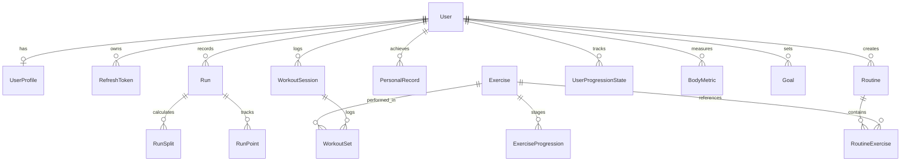

# 03 - Database Schema & Data Models

## 1. Entity Relationship Diagram (ERD)

## 2. Table Descriptions

| Table Name | Description | Key Fields |
|---|---|---|
| `User` | Authentication accounts | `id (UUID)`, `email`, `passwordHash`, `createdAt` |
| `UserProfile` | User preferences & physical info | `userId`, `displayName`, `units (METRIC/IMPERIAL)`, `experienceLevel` |
| `RefreshToken` | Hashed rotation tokens for session security | `id`, `tokenHash`, `userId`, `expiresAt`, `revokedAt` |
| `Exercise` | Library of Gym and Calisthenics movements | `id`, `name`, `type (GYM/CALISTHENICS)`, `muscleGroups`, `equipment`, `instructions`, `formTips` |
| `ExerciseProgression`| Level stages in calisthenics trees | `id`, `skill (PUSH/PULL/LEGS/CORE/HANDSTAND)`, `level`, `exerciseId`, `unlockCriteria` |
| `UserProgressionState`| User progress per skill branch | `userId`, `skill`, `currentLevel`, `unlockedAt` |
| `Routine` | Reusable workout templates | `id`, `userId`, `name`, `notes`, `isPublic` |
| `RoutineExercise` | Exercises within a routine | `routineId`, `exerciseId`, `orderIndex`, `supersetGroupId`, `targetSets`, `targetReps` |
| `WorkoutSession` | Completed or active workout logs | `id (UUID)`, `userId`, `routineId`, `startTime`, `endTime`, `durationSeconds`, `volume` |
| `WorkoutSet` | Individual set performance | `id (UUID)`, `sessionId`, `exerciseId`, `setNumber`, `weightKg`, `reps`, `isCompleted`, `rpe`, `isWarmup` |
| `PersonalRecord` | Historical PR milestones | `id`, `userId`, `exerciseId`, `type (MAX_WEIGHT/MAX_REPS/MAX_VOLUME)`, `value`, `achievedAt` |
| `Run` | Outdoor run sessions | `id (UUID)`, `userId`, `distanceMeters`, `durationSeconds`, `avgPaceSecKm`, `elevationGainMeters`, `polyline` |
| `RunPoint` | Raw or sampled GPS waypoints | `runId`, `latitude`, `longitude`, `altitude`, `speed`, `timestamp` |
| `RunSplit` | Kilometer or mile split splits | `runId`, `splitNumber`, `durationSeconds`, `paceSecKm`, `elevationChange` |
| `BodyMetric` | Body weight and composition tracker | `userId`, `weightKg`, `bodyFatPercentage`, `loggedAt` |
| `Goal` | Weekly activity and strength targets | `userId`, `type`, `targetValue`, `currentValue`, `weekStartDate` |
