# 06 - UI / UX User Flows

## 1. Information Architecture
FitTrack centers around 4 core bottom navigation tabs:

```mermaid
graph TD
    App[FitTrack App]
    App --> Today[Today Tab]
    App --> Train[Train Tab]
    App --> Progress[Progress Tab]
    App --> Profile[Profile Tab]

    Today --> QuickStart[Quick Start / Next Workout]
    Today --> WeeklyGoal[Weekly Goal Ring & Streak]
    Today --> LastSummary[Last Workout Summary]

    Train --> Gym[Gym Routines]
    Train --> Calisthenics[Calisthenics Skill Trees]
    Train --> Run[Outdoor Run Tracker]
    Train --> ExerciseLib[Exercise Library]

    Progress --> Cal[Workout Calendar Heatmap]
    Progress --> PRs[Personal Records List]
    Progress --> Charts[Volume & 1RM Trends]
    Progress --> MuscleHeatmap[Weekly Muscle Heatmap]

    Profile --> Prefs[Units & Experience Level]
    Profile --> Theme[Theme Mode: System / Dark / Light]
    Profile --> Export[Data Export CSV / GPX]
    Profile --> Delete[Delete Account GDPR]
```

## 2. Key Screen Flows

### Flow A: Quick Start Workout (Max 2 Taps)
1. **Tap 1**: User opens app (Today tab) and taps `"Start Push Day"` or goes to Train tab and taps `"Start"`.
2. **Tap 2**: Active Workout Screen launches immediately with pre-filled previous weights and reps.
3. User completes a set -> taps checkbox -> Rest timer automatically counts down with haptic buzz.
4. User taps `"Finish Workout"` -> Summary modal displays total volume, sets, and auto-detected PRs.

### Flow B: Outdoor Run with GPS
1. User taps `"Outdoor Run"` in Train tab.
2. App checks location permissions (foreground & background).
3. User taps `"Start Run"` -> 3-second countdown -> GPS tracking starts.
4. Screen displays elapsed time, distance (km), current pace (min/km), and live map route.
5. User locks screen with Lock Button to prevent sweat/pocket taps.
6. Finish -> Post-run summary screen displays splits, pace elevation chart, and GPX download button.
