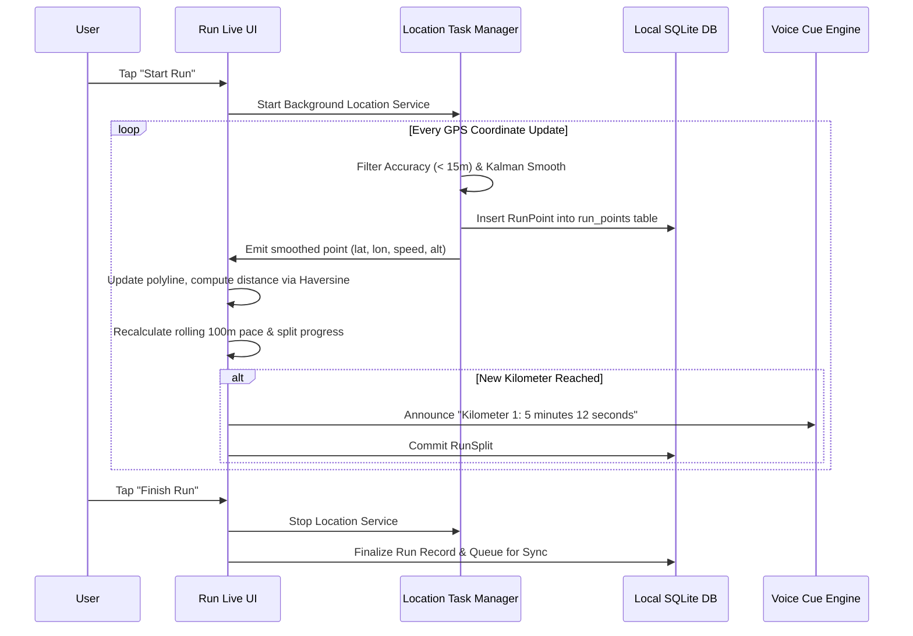

# 07 - GPS Run Tracking Specification

## 1. Location Engine Architecture
The outdoor run tracker utilizes `expo-location` and `expo-task-manager` to ensure continuous background tracking even when the phone is locked or the user switches apps.

## 2. GPS Filtering & Route Smoothing
1. **Accuracy Filtering**: Any point with horizontal accuracy worse than 15 meters is dropped to eliminate satellite scatter.
2. **Speed Anomaly Detection**: Points implying an instantaneous speed over 45 km/h (running max sprint threshold) are flagged as GPS jumps and ignored.
3. **Haversine Distance**: Total distance is incrementally calculated using the great-circle Haversine formula between smoothed points.
4. **Auto-Pause**: If consecutive smoothed speed readings remain below 0.6 m/s (approx. 2.1 km/h) for longer than 6 seconds, the workout enters auto-paused state until movement resumes.

## 3. Battery Conservation & Crash Resilience
- Foreground service with continuous low-frequency wake-lock.
- Every single GPS point is persisted immediately to `expo-sqlite`. In the event of an OS crash or battery die-out, the run can be resumed or recovered intact on next launch.
