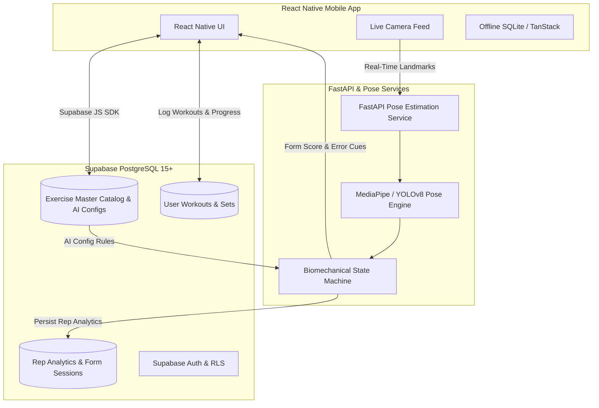

# Production-Ready Exercise Database Architecture

A normalized, production-grade PostgreSQL / Supabase database architecture designed for an AI-powered fitness mobile application built with **React Native**, **Supabase**, and **FastAPI / Computer Vision**.

---

## 1. System Architecture & Context



### Decoupling Strategy:
- **Zero openGym Source Dependency**: Uses only raw exercise metadata schema from `hasaneyldrm/exercises-dataset`.
- **`external_id` Tracking**: Preserves original source IDs (e.g. `'0001'`, `'0043'`) for idempotent updates and external cross-referencing.
- **Custom Extensibility**: Fully extensible for new in-house exercises, video demonstrations, custom muscle taxonomies, and multi-angle camera configs.

---

## 2. Entity-Relationship Diagram (ERD)

```mermaid
erDiagram
    exercises ||--o{ exercise_instructions : "has translations"
    exercises ||--o{ exercise_media : "has media"
    exercises ||--o{ exercise_muscles : "targets"
    muscle_groups ||--o{ exercise_muscles : "targeted by"
    exercises ||--o{ exercise_equipment : "requires"
    equipment ||--o{ exercise_equipment : "used in"
    exercises ||--o{ exercise_category_map : "categorized under"
    exercise_categories ||--o{ exercise_category_map : "contains"
    exercises ||--o| exercise_ai_config : "defines AI pose rules"
    exercises ||--o{ exercise_variations : "has variations"
    exercises ||--o{ exercise_relationships : "originates link"
    exercises ||--o{ exercise_relationships : "targets link"

    workouts ||--o{ workout_exercises : "includes"
    exercises ||--o{ workout_exercises : "performed as"
    workout_exercises ||--o{ exercise_sets : "contains sets"

    workouts ||--o{ exercise_analysis_sessions : "tracks"
    exercises ||--o{ exercise_analysis_sessions : "analyzed in"
    exercise_analysis_sessions ||--o{ exercise_rep_analysis : "contains rep telemetry"

    exercises {
        uuid id PK
        varchar external_id UK
        varchar name
        varchar slug UK
        text description
        varchar category
        varchar body_part
        varchar equipment
        varchar target_muscle
        text_array secondary_muscles
        varchar difficulty
        varchar exercise_type
        text_array instructions
        text_array benefits
        text_array precautions
        boolean is_active
        tsvector search_vector
        timestamptz created_at
        timestamptz updated_at
    }

    exercise_instructions {
        uuid id PK
        uuid exercise_id FK
        varchar language_code
        jsonb instruction_steps
        timestamptz created_at
        timestamptz updated_at
    }

    exercise_media {
        uuid id PK
        uuid exercise_id FK
        varchar media_type
        text url
        text thumbnail_url
        text storage_path
        numeric duration_seconds
        int width
        int height
        varchar source
        varchar license
        text attribution
        boolean is_primary
        timestamptz created_at
    }

    muscle_groups {
        uuid id PK
        varchar name UK
        varchar slug UK
        text description
        timestamptz created_at
    }

    exercise_muscles {
        uuid id PK
        uuid exercise_id FK
        uuid muscle_group_id FK
        varchar role
    }

    equipment {
        uuid id PK
        varchar name UK
        varchar slug UK
        text description
        timestamptz created_at
    }

    exercise_equipment {
        uuid id PK
        uuid exercise_id FK
        uuid equipment_id FK
    }

    exercise_categories {
        uuid id PK
        varchar name UK
        varchar slug UK
        text description
        timestamptz created_at
    }

    exercise_category_map {
        uuid exercise_id PK,FK
        uuid category_id PK,FK
    }

    exercise_ai_config {
        uuid id PK
        uuid exercise_id FK,UK
        boolean pose_detection_supported
        boolean rep_counting_supported
        boolean form_analysis_supported
        jsonb required_keypoints
        jsonb optional_keypoints
        jsonb movement_phases
        jsonb angle_rules
        jsonb distance_rules
        jsonb form_rules
        jsonb common_mistakes
        jsonb correction_messages
        numeric minimum_confidence
        timestamptz created_at
        timestamptz updated_at
    }

    exercise_variations {
        uuid id PK
        uuid exercise_id FK
        varchar variation_name
        text description
        varchar difficulty_change
        varchar equipment_change
        text instructions
        timestamptz created_at
    }

    exercise_relationships {
        uuid id PK
        uuid exercise_id FK
        uuid related_exercise_id FK
        varchar relationship_type
        timestamptz created_at
    }

    workouts {
        uuid id PK
        uuid user_id
        varchar name
        timestamptz started_at
        timestamptz completed_at
        int duration_seconds
        numeric calories_burned
        text notes
        timestamptz created_at
    }

    workout_exercises {
        uuid id PK
        uuid workout_id FK
        uuid exercise_id FK
        int order_index
        int target_sets
        int target_reps
        int target_duration_seconds
    }

    exercise_sets {
        uuid id PK
        uuid workout_exercise_id FK
        int set_number
        int reps
        numeric duration_seconds
        numeric weight
        int rest_seconds
        numeric form_score
        numeric ai_confidence
        timestamptz completed_at
    }

    exercise_analysis_sessions {
        uuid id PK
        uuid user_id
        uuid workout_id FK
        uuid exercise_id FK
        timestamptz started_at
        timestamptz ended_at
        int total_reps
        int correct_reps
        int incorrect_reps
        numeric average_form_score
        numeric average_confidence
        numeric calories_estimated
        jsonb feedback
        timestamptz created_at
    }

    exercise_rep_analysis {
        uuid id PK
        uuid analysis_session_id FK
        int rep_number
        numeric form_score
        numeric confidence
        boolean is_valid
        jsonb detected_errors
        jsonb correction_feedback
        jsonb keypoint_data
        timestamptz started_at
        timestamptz completed_at
    }
```



---

## 3. Data Dictionary

### 3.1 `exercises` (Master Catalog)
| Column | Type | Nullable | Description & Constraints |
|---|---|---|---|
| `id` | `UUID` | No | Primary key (`gen_random_uuid()`). |
| `external_id` | `VARCHAR(100)` | Yes | Unique external dataset ID (e.g., `'0001'`). |
| `name` | `VARCHAR(255)` | No | Full exercise name (e.g., `'Barbell Back Squat'`). |
| `slug` | `VARCHAR(255)` | No | Unique URL-friendly slug (e.g., `'barbell-back-squat'`). |
| `description` | `TEXT` | Yes | Biomechanical overview and execution focus. |
| `category` | `VARCHAR(100)` | Yes | Primary category (`'Strength'`, `'Calisthenics'`, etc.). |
| `body_part` | `VARCHAR(100)` | Yes | Body region (`'chest'`, `'upper legs'`, `'waist'`). |
| `equipment` | `VARCHAR(100)` | Yes | Denormalized primary equipment requirement. |
| `target_muscle` | `VARCHAR(100)` | Yes | Primary agonist muscle. |
| `secondary_muscles`| `TEXT[]` | No | Array of supporting synergist muscles. |
| `difficulty` | `VARCHAR(50)` | No | `'beginner'`, `'intermediate'`, `'advanced'`, `'expert'`. |
| `exercise_type` | `VARCHAR(50)` | No | `'strength'`, `'cardio'`, `'calisthenics'`, etc. |
| `instructions` | `TEXT[]` | No | Default ordered text steps. |
| `benefits` | `TEXT[]` | No | Bulleted list of physiological benefits. |
| `precautions` | `TEXT[]` | No | Safety precautions and contraindications. |
| `is_active` | `BOOLEAN` | No | Soft-delete / draft visibility control (`DEFAULT true`). |
| `search_vector` | `tsvector` | No | Generated full-text search column with weighted terms. |
| `created_at` | `TIMESTAMPTZ`| No | Auto-set creation timestamp. |
| `updated_at` | `TIMESTAMPTZ`| No | Auto-updated via trigger. |

---

### 3.2 `exercise_instructions` (Multilingual)
Supports global localization across English (`en`), Spanish (`es`), Turkish (`tr`), Italian (`it`), Russian (`ru`), Chinese (`zh`), German (`de`), French (`fr`), Portuguese (`pt`), Japanese (`ja`).

```json
[
  {"step": 1, "text": "Set stance slightly wider than shoulder width.", "cue": "Tripod foot balance"},
  {"step": 2, "text": "Inhale deeply into belly and brace your core.", "cue": "360-degree core brace"},
  {"step": 3, "text": "Descend until hip crease drops below knees.", "cue": "Hit parallel depth"}
]
```

---

### 3.3 `exercise_media` (Licensing & Attribution)
Stores asset locations and explicitly tags copyright information so third-party placeholders can be audited and replaced cleanly.
- `media_type`: `'image'`, `'gif'`, `'video'`
- `source`: e.g. `'hasaneyldrm/exercises-dataset'`, `'in-house-motion-capture-studio'`
- `license`: e.g. `'Unlicensed-Third-Party-Placeholder'`, `'CC-BY-4.0'`, `'Proprietary-App-License'`
- `attribution`: Author attribution or replacement directive
- `is_primary`: Flag identifying the main hero video / animation

---

### 3.4 `exercise_ai_config` (Computer Vision & Pose Rules)
Configures MediaPipe / YOLOv8 pose landmark state machines for real-time rep counting and biomechanical posture analysis:

```json
{
  "movement_phases": ["start", "down", "inflection_bottom", "up", "complete"],
  "angle_rules": {
    "knee": {
      "down": {"min": 65, "max": 95},
      "up": {"min": 160, "max": 180}
    },
    "hip": {
      "down": {"min": 60, "max": 90},
      "up": {"min": 165, "max": 180}
    }
  },
  "distance_rules": {
    "feet_to_shoulder_width_ratio": {"min": 1.05, "max": 1.45},
    "knee_lateral_displacement_tolerance": 0.08
  },
  "form_rules": {
    "depth_criteria": "hip_y_greater_than_or_equal_to_knee_y",
    "torso_neutrality": {"max_forward_lean_degrees": 45}
  },
  "common_mistakes": [
    {"code": "insufficient_depth", "name": "Shallow Squat", "penalty": 20},
    {"code": "knee_valgus", "name": "Knees Collapsing Inward", "penalty": 25}
  ],
  "correction_messages": {
    "insufficient_depth": "Squat deeper until hip crease reaches parallel.",
    "knee_valgus": "Push your knees outward in line with your toes."
  },
  "minimum_confidence": 0.72
}
```

---

## 4. Slugs & Search Architecture

### 4.1 Automated Fraction Slugification
Exercise names with fractions are expanded to URL/app-friendly words:
- `"3/4 sit-up"` $\rightarrow$ `"three-quarter-sit-up"`
- `"1/2 squat jump"` $\rightarrow$ `"half-squat-jump"`
- `"Push-Up"` $\rightarrow$ `"push-up"`
- Collision handling automatically appends `-2`, `-3` if an identical name exists.

### 4.2 Full-Text & Fuzzy Trigram Search Function
The database includes the `search_exercises(...)` RPC function combining:
1. **PostgreSQL Full-Text Search (`tsvector` & `websearch_to_tsquery`)** with weighting (Name: A, Description: B, Muscle/Equipment: C).
2. **Trigram Index (`pg_trgm`)** for typo-tolerant fuzzy matching (e.g. typing `"squatt"` or `"bench pres"` returns correct items).
3. **Multi-Column Filtering**: Muscle, body part, equipment, category, difficulty, and exercise type.
4. **Primary Media & AI Support Flags** returned in a single SQL round-trip.

---

## 5. Deployment & Execution Runbook

### Step 1: Run the Database Migration
In the **Supabase Dashboard $\rightarrow$ SQL Editor** (or via Supabase CLI `supabase db push`), execute:
[`supabase/migrations/20261005000000_exercise_database_init.sql`](file:///home/dhruv/Documents/exercise-app/supabase/migrations/20261005000000_exercise_database_init.sql)

### Step 2: Seed Canonical Data
Run the reference seed file in the SQL Editor:
[`supabase/seed.sql`](file:///home/dhruv/Documents/exercise-app/supabase/seed.sql)

### Step 3: Run the 1,324 Exercises ETL Importer
Run the Python ETL pipeline using your virtual environment:

```bash
cd backend
./.venv/bin/python scripts/import_exercises_dataset.py \
  --file path/to/exercises.json \
  --db-url "postgresql://postgres:[PASSWORD]@[HOST]:5432/postgres" \
  --export-sql ../supabase/import_exercises.sql
```

*(If you prefer to review before applying, omit `--db-url` to generate `supabase/import_exercises.sql` and run it in the Supabase SQL editor).*

### Step 4: React Native Integration
Import the typed service in your React Native app:

```typescript
import { ExerciseDatabaseService } from '../services/exerciseDatabaseService';
import { supabase } from '../services/supabaseClient';

const exerciseService = new ExerciseDatabaseService(supabase);

// Search with typo-tolerance
const results = await exerciseService.searchExercises({
  query: 'squat',
  equipment: 'barbell',
  targetMuscle: 'quadriceps',
});

// Fetch detailed view with localized Spanish instructions
const exercise = await exerciseService.getExerciseBySlug('barbell-back-squat', 'es');
```
